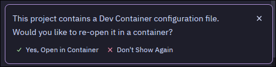

#  Zig devcontainer
A complete Zig development environment follwoing the devcontainer standard, compatibel with 0.15.x and the 0.16.0-dev builds of zig.

## usage
to use simply clone the repo and copy the ```.devcontainer``` directory into your project.

```code
git clone https://github.com/LostFlashlight/Zig-Devcontainer.git
cp -r Zig-Devcontainer/.devcontainer <your project directory>
```
Then, open your DevContainer-compatible editor (tested with Zed and VSCode) and confirm that it opens your project in the container.



This will download the DevContainer Ubuntu image, run the install_zig.sh script, and provide the result as your environment with Zig and ZLS installed, without touching your files.
